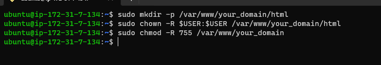
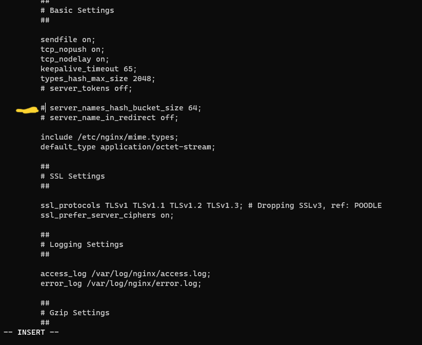

# Install Nginx on Ubuntu 20.04

### Introduction

Nginx is one of the most popular web servers in the world and is responsible for hosting some of the largest and highest-traffic sites on the internet. It is a lightweight choice that can be used as either a web server or reverse proxy.

In this guide, we’ll discuss how to install Nginx on your Ubuntu 20.04 server, adjust the firewall, manage the Nginx process, and set up server blocks for hosting more than one domain from a single server.

#### Step 1

Spin up an EC2 instance using ubuntu 20.04 as the operating system.
Log into the instance terminal 

#### Step 2
**Installing Nginx**

Because Nginx is available in Ubuntu’s default repositories, it is possible to install it from these repositories using the `apt` packaging system.

Since this is our first interaction with the apt packaging system in this session, we will update our local package index so that we have access to the most recent package listings. Afterwards, we can install nginx

>           sudo apt update
>           sudo apt install nginx

Open Port 80 in your security setting in the AWS console for Http access

#### Step 3
**Checking your webserver**

At the end of the installation process, Ubuntu 20.04 starts Nginx. The web server should already be up and running.

We can check with the systemd init system to make sure the service is running by typing

>           systemctl status nginx

As confirmed by this out, the service has started successfully. However, the best way to test this is to actually request a page from Nginx.

You can access the default Nginx landing page to confirm that the software is running properly by navigating to your server’s IP address. You can get this from AWS console. The Public IP of the instance

When you have your server’s IP address, enter it into your browser’s address bar

>           http://your_server_ip

You should receive the default Nginx landing page:

If you are on this page, your server is running correctly and is ready to be managed.

#### Step 4 
**Managing the Nginx Process**

Now that you have your web server up and running, let’s review some basic management commands.

To stop your web server, type:

>           sudo systemctl stop nginx

To start the web server when it is stopped, type

>           sudo systemctl start nginx

To stop and then start the service again, type:

>           sudo systemctl restart nginx

#### Step 5 
**Setting Up Server Blocks (Recommended)**

When using the Nginx web server, server blocks (similar to virtual hosts in Apache) can be used to encapsulate configuration details and host more than one domain from a single server. We will set up a domain called `your_domain`, but you should replace this with your own domain name (if you have)

Nginx on Ubuntu 20.04 has one server block enabled by default that is configured to serve documents out of a directory at `/var/www/html`. While this works well for a single site, it can become unwieldy if you are hosting multiple sites. Instead of modifying `/var/www/html`, let’s create a directory structure within `/var/www` for our `your_domain` site, leaving `/var/www/html` in place as the default directory to be served if a client request doesn’t match any other sites.

Create the directory for `your_domain` as follows, using the `-p` flag to create any necessary parent directories:

>           sudo mkdir -p /var/www/your_domain/html

Next, assign ownership of the directory with the $USER environment variable:

>           sudo chown -R $USER:$USER /var/www/your_domain/html

The permissions of your web roots should be correct if you haven’t modified your umask value, which sets default file permissions. To ensure that your permissions are correct and allow the owner to read, write, and execute the files while granting only read and execute permissions to groups and others, you can input the following command:

>           sudo chmod -R 755 /var/www/your_domain

Next, create a sample index.html page using `vi` or your favorite editor:

sudo vi /var/www/your_domain/html/index.html

Inside, add the following sample HTML:

    <html>
        <head>
            <title>Welcome to your_domain!</title>
        </head>
        <body>
            <h1>Success!  The your_domain server block is working!</h1>
        </body>
    </html>

Save and close the file 

In order for Nginx to serve this content, it’s necessary to create a server block with the correct directives. Instead of modifying the default configuration file directly, let’s make a new one at `/etc/nginx/sites-available/your_domain`

>           sudo vi /etc/nginx/sites-available/your_domain

Paste in the following configuration block, which is similar to the default, but updated for our new directory and domain name:

    server {
            listen 80;
            listen [::]:80;

            root /var/www/your_domain/html;
            index index.html index.htm index.nginx-debian.html;

            server_name your_domain www.your_domain;

            location / {
                    try_files $uri $uri/ =404;
            }
    }

Notice that we’ve updated the root configuration to our new directory, and the server_name to our `domain name`.

Next, let’s enable the file by creating a link from it to the sites-enabled directory, which Nginx reads from during startup:

>           sudo ln -s /etc/nginx/sites-available/your_domain /etc/nginx/sites-enabled/

***Note***: Nginx uses a common practice called symbolic links, or symlinks, to track which of your server blocks are enabled. Creating a symlink is like creating a shortcut on disk, so that you could later delete the shortcut from the `sites-enabled` directory while keeping the server block in `sites-available` if you wanted to enable it.

Two server blocks are now enabled and configured to respond to requests based on their `listen` and `server_name` directives:

`your_domain`: Will respond to requests for `your_domain` and `www.your_domain`.
`default`: Will respond to any requests on port 80 that do not match the other two blocks.
To avoid a possible hash bucket memory problem that can arise from adding additional server names, it is necessary to adjust a single value in the `/etc/nginx/nginx.conf` file. Open the file

>           sudo vi /etc/nginx/nginx.conf

Find the `server_names_hash_bucket_size` directive and remove the `#` symbol to uncomment the line. If you are using nano, you can quickly search for words in the file by pressing `CTRL` and `w`.

Save and close the file when you are finished.

Next, test to make sure that there are no syntax errors in any of your Nginx files:

>           sudo nginx -t

If there aren’t any problems, restart Nginx to enable your changes:

>           sudo systemctl restart nginx

Nginx should now be serving your domain name. You can test this by navigating to http://your_domain, where you should see something like this:

#### I hope you learnt something?

